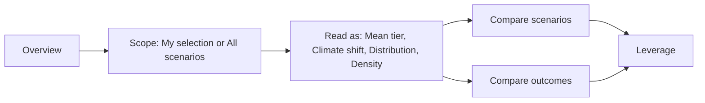

# Resilience Panel Proposal

## Recommendation
Organize the panel around four user questions, not around the raw control/state model.

1. `Overview` (`aggregate`): the default landing state. One matrix, all outcomes by hydroclimate, starting in mean-tier mode.
2. `Compare scenarios` (`scenario`): small multiples for the current shortlist or all scenarios.
3. `Compare outcomes` (`outcome`): small multiples by outcome, to see which rows are most climate-sensitive or operationally variable.
4. `Leverage` (`quadrant`): a separate analysis mode for climate sensitivity vs operational leverage.

This matches the existing view model in [apps/main/app/features/scenarioExplorer/exploreView/ResiliencePanel.tsx](apps/main/app/features/scenarioExplorer/exploreView/ResiliencePanel.tsx), but presents it in a way that follows the same narrative already hinted at in [apps/main/app/features/scenarioExplorer/components/howToReadContent/ResilienceHowToRead.tsx](apps/main/app/features/scenarioExplorer/components/howToReadContent/ResilienceHowToRead.tsx) and [apps/main/app/features/scenarioExplorer/exploreView/ResilienceChartTuner.tsx](apps/main/app/features/scenarioExplorer/exploreView/ResilienceChartTuner.tsx).

```72:115:apps/main/app/features/scenarioExplorer/exploreView/ResiliencePanel.tsx
export type ResilienceView = "scenario" | "outcome" | "aggregate" | "quadrant"
...
export interface ResilienceControlsState {
  view: ResilienceView
  cellEncoding: CellEncoding
  deltaMode: DeltaMode
```

## Proposed Panel Structure

### 1. Top row: primary mode rail
Replace the current mixed `View:` + `Analyze:` split with one dominant mode rail:

- `Overview`
- `Compare scenarios`
- `Compare outcomes`
- `Leverage`

Each mode should carry a one-line helper sentence directly below the rail so users know what the chart is for before they start toggling options.

Recommended labels mapped to current render paths:
- `Overview` -> current `aggregate`
- `Compare scenarios` -> current `scenario`
- `Compare outcomes` -> current `outcome`
- `Leverage` -> current `quadrant`

Why: `quadrant` is not just another analysis toggle. It is already a distinct panel route in [apps/main/app/features/scenarioExplorer/ScenarioExplorer.tsx](apps/main/app/features/scenarioExplorer/ScenarioExplorer.tsx) and [apps/main/app/features/scenarioExplorer/exploreView/ResilienceQuadrantPanel.tsx](apps/main/app/features/scenarioExplorer/exploreView/ResilienceQuadrantPanel.tsx), so it should read as a separate mode, not as a side-chip.

### 2. Second row: "Read as" and scope
After the user chooses the mode, let them choose how the cells should speak.

Recommended control groups:
- `Read as`
- `Scope`
- `Rows`
- conditional `Reference`

#### `Read as`
Mode-specific, so the user only sees options that truly fit the current view.

- In `Overview`:
  - `Mean tier`
  - `Climate shift`
  - `Risk density`
  - `Opportunity density`
  - `Distribution`
  - `Operational leverage`
- In `Compare scenarios` and `Compare outcomes`:
  - `Mean tier`
  - `Distribution`
  - optionally `Climate shift` later, but only if it reads clearly at small-multiple scale
- In `Leverage`:
  - no `Read as`; this mode already has its own encoding logic

Important simplification: fold `deltaMode` into the user-facing encoding model. Instead of asking the user to think `Cell: mean tier` plus `Climate shift: vs historical`, expose `Climate shift` as a first-class read mode, then reveal a smaller `Reference` control only when that mode is active.

#### `Scope`
Unify the mental model of `showAllScenarios` and `aggregateScope` under one UI concept:
- `My selection`
- `All scenarios`

Internally you can still keep the current split state, but the user should feel like they are answering one consistent question: "am I reading the whole field or my shortlist?"

#### `Rows`
Move `choose outcome rows` out of the main chip soup and into a dedicated `Rows` control that opens a drawer or side sheet. Show the current count inline, e.g. `Rows: 8 outcomes`.

Why: this is not a primary navigation decision. It is a scope-shaping task, and it deserves a stable chooser rather than an overlay toggle hidden among chips.

### 3. Third row: hydroclimates
Keep hydroclimate chips in a stable location directly above the chart area.

- Show them in `Overview`, `Compare scenarios`, and `Compare outcomes`
- Hide them in `Leverage`, as the quadrant already aggregates climate sensitivity differently

This keeps the column-axis filter visually tied to the matrix itself instead of mixed into the larger control bar.

### 4. Display options in an overflow menu
Move these out of the main controls row:
- `reorder by similarity`
- `show marginals`
- `show cell values`

Put them behind a `Display` popover or overflow menu.

Why: they are valuable, but they are refinement controls, not wayfinding controls. Right now they compete with view, scope, and encoding in [apps/main/app/features/scenarioExplorer/exploreView/ResilienceControls.tsx](apps/main/app/features/scenarioExplorer/exploreView/ResilienceControls.tsx).

## Recommended Default Flow

Make the panel teach itself by default.

1. Land in `Overview`
   - scope: `All scenarios`
   - read as: `Mean tier`
   - hydroclimates: all visible
2. Narrow to `My selection` once the user has pinned a shortlist elsewhere
3. Switch `Read as` to `Climate shift` or `Distribution` when the overview looks too clean
4. Move to `Compare scenarios` to inspect shortlisted scenario tiles
5. Move to `Compare outcomes` when the question becomes outcome-specific
6. Move to `Leverage` only after the user asks, "what can operations actually move?"

This is much closer to the story already encoded in the tuner presets (`Overview`, `All scenarios`, `All outcomes`, `Scenario distribution`, `Climate shift`, `Risk density`) in [apps/main/app/features/scenarioExplorer/exploreView/ResilienceChartTuner.tsx](apps/main/app/features/scenarioExplorer/exploreView/ResilienceChartTuner.tsx).

## Recommendation for `TUNE CHART`
Do not let `TUNE CHART` remain a second full control surface beside the persistent toolbar.

Instead, convert it into one of these:
- `Suggested views`: a preset launcher only
- onboarding-only walkthrough that can be dismissed once the user understands the panel

The main panel should own the day-to-day IA. The tuner should feel like guided help, not a duplicate settings panel.

## Why this is better than the current layout
The current controls bar in [apps/main/app/features/scenarioExplorer/exploreView/ResilienceControls.tsx](apps/main/app/features/scenarioExplorer/exploreView/ResilienceControls.tsx) mixes four different kinds of decision in one wrapped toolbar:
- chart mode
- scenario/outcome scope
- cell encoding/comparison logic
- display refinements

That creates a high cognitive load because the user has to understand the implementation model before they understand the chart.

The proposed layout instead asks the questions in order:
1. What kind of question am I asking?
2. How do I want to read the data?
3. Am I looking at all scenarios or my shortlist?
4. Which rows and climates matter?
5. Do I want extra display refinements?

## Interaction Model to Preserve
Keep these behaviors because they support the proposal well:
- `Comparing N of M` context chip in small-multiple views
- expand/back tile flow in [apps/main/app/features/scenarioExplorer/exploreView/ResiliencePanel.tsx](apps/main/app/features/scenarioExplorer/exploreView/ResiliencePanel.tsx)
- map-linked hover/click in distribution mode
- LOI-specific interaction in the quadrant panel

Those are strong secondary interactions. The proposal is about making the primary navigation and option structure easier to understand.

## Proposed IA Diagram


## Implementation Direction
If you choose to build this, I would do it in this order:
- reshape the visible IA in [apps/main/app/features/scenarioExplorer/exploreView/ResilienceControls.tsx](apps/main/app/features/scenarioExplorer/exploreView/ResilienceControls.tsx)
- change the default state in [apps/main/app/features/scenarioExplorer/ScenarioExplorer.tsx](apps/main/app/features/scenarioExplorer/ScenarioExplorer.tsx) from `scenario` to `aggregate`
- move outcome-row selection from overlay-trigger chip to a dedicated row chooser affordance in [apps/main/app/features/scenarioExplorer/exploreView/ResiliencePanel.tsx](apps/main/app/features/scenarioExplorer/exploreView/ResiliencePanel.tsx)
- demote [apps/main/app/features/scenarioExplorer/exploreView/ResilienceChartTuner.tsx](apps/main/app/features/scenarioExplorer/exploreView/ResilienceChartTuner.tsx) into presets/onboarding instead of parallel control chrome
- then update the resilience how-to copy so the panel IA and the modal tell the same story
